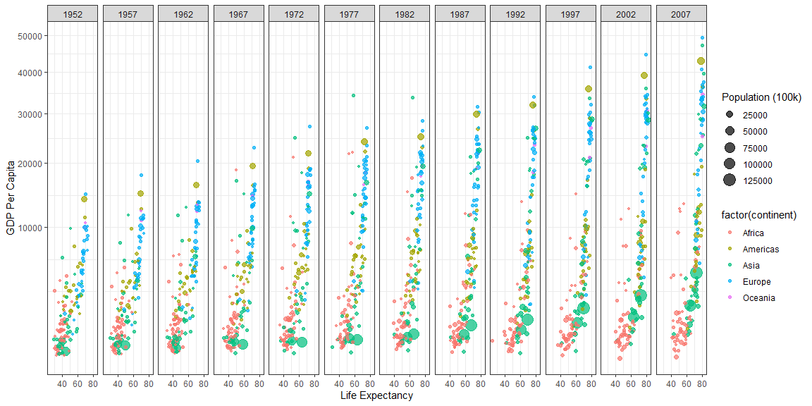
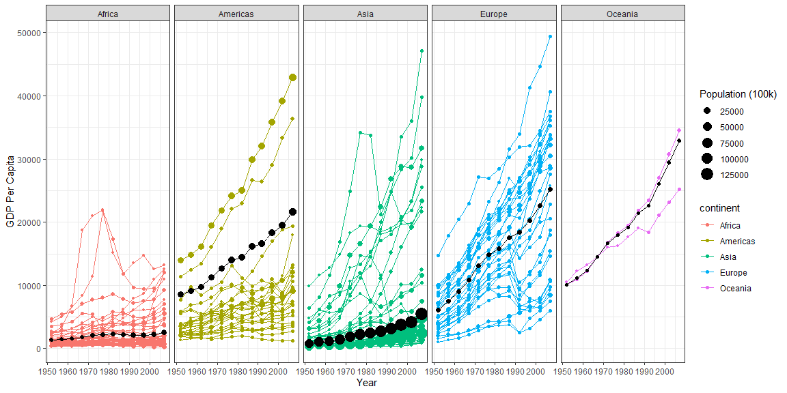

## Background


Hans Rosling is one of the most popular data scientists on the web. His original TED talk was very popular among my friends when it came out. We are going to create some graphics using his formatted data as our weekly case study.


## Data Visualization


```r
# Use this R-Chunk to import all your datasets!
filter(gapminder, country != "Kuwait") %>% ggplot(aes(x = lifeExp, y = gdpPercap, color = factor(continent), size = pop/10000)) +  scale_y_continuous(trans = "sqrt") + facet_grid(~ year) + geom_point(alpha = .7) + labs(size = "Population (100k)", x = "Life Expectancy", y = "GDP Per Capita") + theme_bw() + guides( size = guide_legend(order = 1), color = guide_legend(order=2))
```

<!-- -->


```r
# Use this R-Chunk to clean & wrangle your data!
gwd <- filter(gapminder, country != "Kuwait") %>% group_by(continent, year) %>% mutate( wd = weighted.mean(gdpPercap, pop))

filter(gapminder, country != "Kuwait") %>%
  ggplot() + 
  geom_point(aes(x = year, y = gdpPercap, color = continent, size = pop/10000)) + 
  geom_line(aes(group = country, x = year, y = gdpPercap, color = continent)) +
  geom_line(data = gwd, aes(x = year, y = wd)) +
  geom_point(data = gwd, aes(x = year, y = wd, size = pop/10000)) + 
  facet_wrap(~ continent, nrow = 1) + 
  scale_y_continuous() +
  labs(size = "Population (100k)", x = " Year", y = "GDP Per Capita") +
  theme_bw() + 
  guides(size = guide_legend(order = 1), color = guide_legend(order=2))
```

<!-- -->


## 
